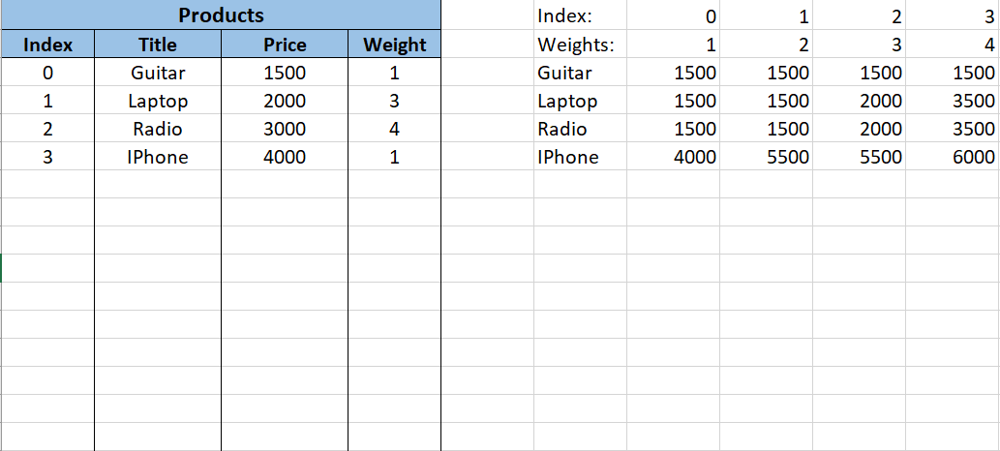

# KnapsackProblem

Given an array P of products

- { Title = "Radio", Price = 3000, Weight = 4 },
- { Title = "Laptop", Price = 2000, Weight = 3 },
- { Title = "Guitar", Price = 1500, Weight = 1 }

Given a knapsack of positive integer capacity N. Find a combination of products such that price is maximal and does not
exceed the size of knapsack.

## Cases

- N = 4. Output: [Laptop, Guitar]
- N = 5. Output: [Laptop, Guitar, Guitar]

## Pseudocode

- Initialize jagged array `int[K][N]` where `K` -- count of products, `N` -- is knapsack capacity
- Sort array of products by the `Weight`
- For each product:
    - If current weight is lesser then product weight: add previous product weight
    - Else add MAX(previous weight, current product weight + remaining weight maximum)

## Example

